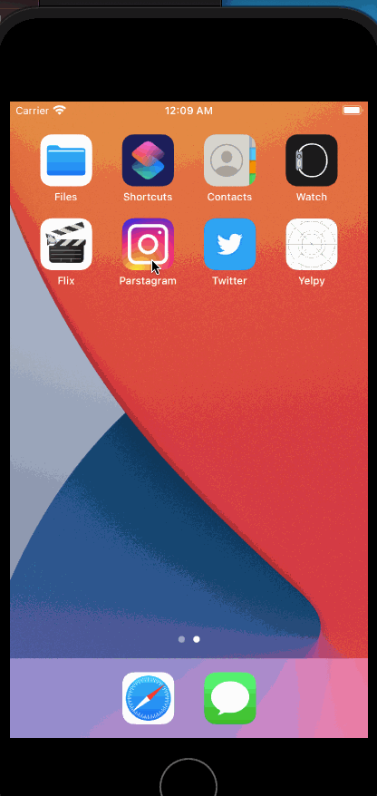

# Parstagram - Part II

This is an Instagram clone with a custom Parse backend that allows a user to post photos, view a global photos feed, and add comments!

Time spent: **X** hours spent in total

## User Stories

The following **required** functionality is completed:

- [X] User stays logged in across restarts. (1pt)
- [ X] User can log out. (1pt)
- [X ] User can view comments on a post. (3pts)
- [X ] User can add a new comment. (5pts)

The following **bonus** features are implemented:

- [ ] User can add a profile picture. (2pts)
- [ ] Profile pictures are shown for posts and comments. (2pts)

## Video Walkthrough

Here's a walkthrough of implemented user stories:

<<<<<<< HEAD

=======

>>>>>>> 92b8634a5c056f7adb412f451be5bda11537be41
# Parstagram - Part I

This is an Instagram clone with a custom Parse backend that allows a user to post photos and view a global photos feed.

Time spent: **3** hours spent in total

## User Stories

The following **required** functionality is completed:

- [x] User sees app icon in home screen and styled launch screen. (1pt)
- [x] User can sign up to create a new account. (1pt)
- [x] User can log in. (1pt)
- [x] User can take a photo, add a caption, and post it to the server. (3pt)
- [x] User can view the last 20 posts. (4pts)

The following **bonus** features are implemented:

- [ ] User can pull to refresh. (1pt)
- [ ] User can load past posts infinitely. (2pts)

## Video Walkthrough

Here's a walkthrough of implemented user stories:

<<<<<<< HEAD

=======

>>>>>>> 92b8634a5c056f7adb412f451be5bda11537be41
